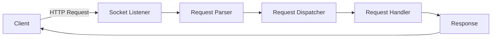
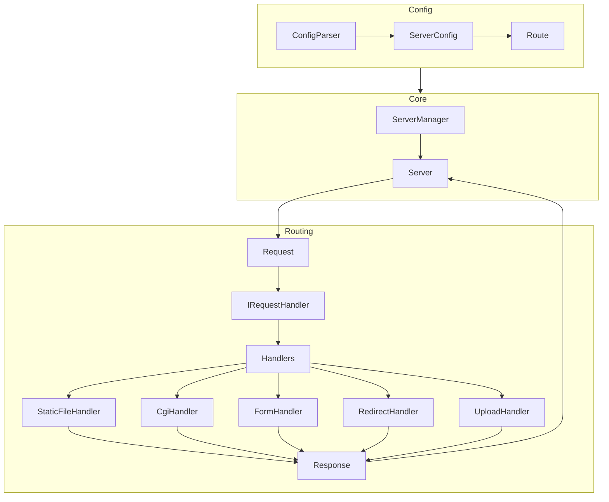

# Webserv

A lightweight HTTP/1.1 web server written in C++ from scratch as part of the 42 Abu Dhabi curriculum.  
This project replicates core features of production servers like Nginx, giving hands-on experience in network programming, request parsing, and server design.

---

## Features
- **HTTP methods**: `GET`, `POST`, `DELETE`
- **CGI execution**: run scripts (e.g. PHP, Python) through the server
- **Custom configuration files**: inspired by Nginx (`.conf`)
- **Autoindex**: directory listing when no index file is present
- **Error handling**: customizable error pages
- **Chunked transfer encoding**
- **Concurrent client handling** using `select()`

---

## Usage
1. **Clone the repo**
   ```
   git clone https://github.com/marsha-t/webserv.git
   cd webserv
   ```
2. **Build the server**
   ```
	make
   ```
3. **Run**
   Run with default configuration (`default.conf`)
   ```
   ./webserv
   ```

   Run with specific configuration file
   ```
   ./webserv multi_server.conf
   ```
5. **Test in browser or curl**
   ```
   curl -v http://localhost:8080 
   ```
## Request–Response Flow
In the lifecycle of a request
 - The client sends an HTTP request
 - The request is parsed into a structured object
 - There is a dispatcher that decides which handler should process it
 - Specialized handlers are responsible for processing the request and building the response.
 - The final response is sent back to the client.



## Architecture Overview
The server is built with a modular, object-oriented design, where each class has a clear responsibility. This makes the codebase easier to extend (e.g., adding new handlers) and maintain. Below is an overview of how the server is structured internally.



The components:
- `ConfigParser` parses the .conf file and translates it into `ServerConfig` (for each `server` block in the config) and `Route` (for each `location` block within a `server`) objects
	- `ServerConfig` stores server-level settings such as hostnames, ports, error pages, and default behaviors.
	`Route` defines location-specific rules: root directories, allowed HTTP methods, redirects, upload paths, and CGI interpreters.
- ServerManager / Server: 
	- `ServerManager` takes the parsed configuration objects and sets up `Server` for each unique (host, port) combination -
	- For each `Server`, there is a listening socket 
	- `ServerManager` also starts up the main event loop using `select()` to monitor sockets for incoming activity
- Request / Response
	- `Request` represents an incoming HTTP request, including method, headers, target URI, and body.
	- `Response` represents the HTTP reply, including status line, headers, and body content.
- `RequestDispatcher` acts as the traffic controller: matches an incoming `Request` to the correct `Route` and forwards it to the appropriate handler.
- `IRequestHandler` is an abstract interface that defines a common contract for all handlers. This enables polymorphism so that  the dispatcher can call any handler without needing to know its concrete type.
- Handlers: Each handler processes a request type and builds the HTTP response directly:
	- `StaticFileHandler` serves static files from the filesystem.
	- `CgiHandler` executes CGI scripts (e.g., PHP, Python) and returns their output.- `FormHandler` handles form submissions (e.g., application/x-www-form-urlencoded, multipart).
	- `RedirectHandler` generates HTTP redirection responses.
	- `UploadHandler` manages file uploads and saves them to configured locations.
